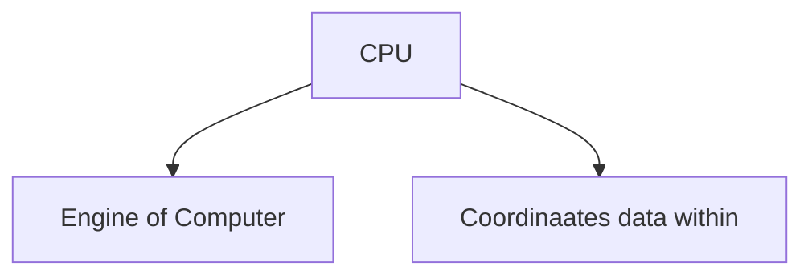
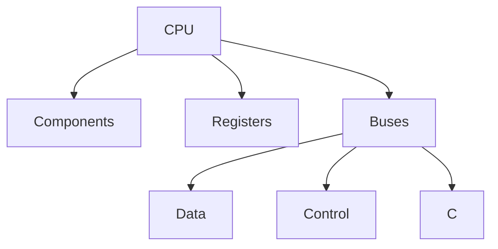

# IB CS HL Unit A1.1

# Sub-Unit A1.1: Computer hardware and operation

# A1.1.1: Describing the functions and interactions of the main CPU components

<aside>

### Key Words

---

| Term | Translation              |
| ------ | -------------------------- |
| ALU  | Arithmetic Logic Unit    |
| CU   | Control Unit             |
| IR   | Instruction Registrar    |
| PC   | Program Counter          |
| MAR  | Memory Address Registrar |
| MDR  | Memory Data Registrar    |
| AC   | Accumulator              |

</aside>

### The CPU

CPU = engine of the computer.

CPU coordinates data movement within system.

CPU Functionality

**CPU Composition**

[https://dl.ibdocs.re/IB BOOKS/Group 4 - Sciences/Computer Science/OXFORD/Computer Science - MacKenty and Stephenson - Oxford 2025.pdf](https://dl.ibdocs.re/IB%20BOOKS/Group%204%20-%20Sciences/Computer%20Science/OXFORD/Computer%20Science%20-%20MacKenty%20and%20Stephenson%20-%20Oxford%202025.pdf)

# A1.1.2 Describe the role of a GPU

# A1.1.3 Explain the differences between the CPU and the GPU

# A1.1.4 Explain the purposes of different types of primary memory

# A1.1.5 Describe the fetch, decode and execute cycle

# A1.1.6 Describe the process of pipelining in multi-core architectures

# A1.1.7 Describe internal and external types of secondary memory storage

# A1.1.8 Describe the concept of compression

# A1.1.9 Describe different types of services in cloud computing
